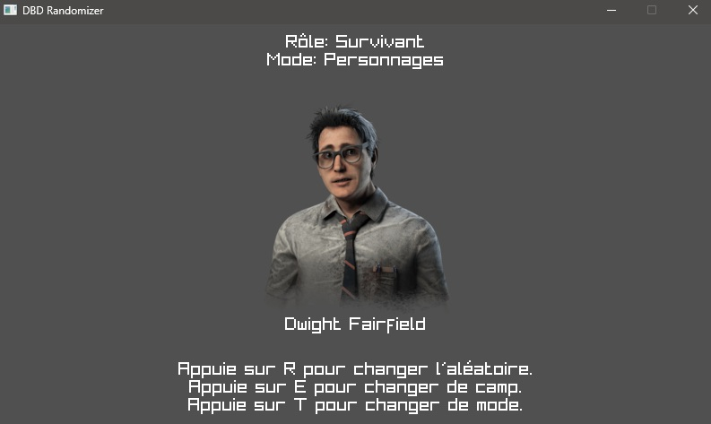

# Dead By Daylight Randomizer - EN

## (Warning !! The application is only in French but the code is in English so if you want to put a translation system in the application, that would be much appreciated)

Like the name said, Dead by Daylight Randomizer is a Randomizer for the video game Dead by Daylight !

I wanted to make this application to test myself with the C programming language / Raylib and to finally succeed in completing a project.

In this application, you can choose to obtain a character (survivor or killer), a perk (survivor or killer) or a map from the game !

Pull requests are allowed !

# Dead By Daylight Randomizer - FR

## (Attention !! L'application est uniquement en français mais le code est en anglais, donc si vous voulez mettre un système de traduction dans l'application, cela sera très apprécié.)

Comme le nom l'indique, Dead by Daylight Randomizer est un Randomizer pour le jeu vidéo Dead by Daylight !

Je voulais faire une application pour me tester avec le langage de programmation C / Raylib et pour enfin réussir à finir un projet.

Dans cette application, vous pouvez choisir d'obtenir un personnage (survivant ou tueur), une perk (survivant ou tueur) ou une carte du jeu !

Les Pull requests sont autorisées !